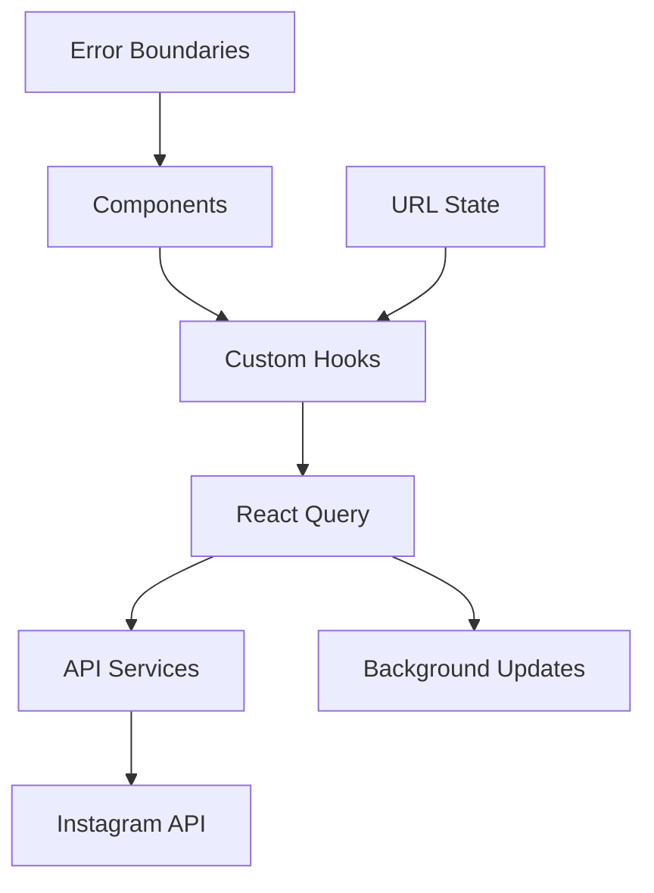

# Instagram Archiver

A modern Instagram story and user archiving application built with Next.js 15 and the Neo Brutalism design system. Archive, browse, and manage Instagram content with a bold, accessible interface.

## ✨ Features

### Core Functionality

- 📱 **Instagram Stories Archiving** - Browse and archive Instagram stories with pagination and search
- 👥 **User Profile Management** - Comprehensive user profiles with history tracking
- 🔍 **Advanced Search & Filtering** - Search stories and users with real-time filtering
- 📊 **User Analytics** - Track user engagement and story metrics
- 🎨 **Neo Brutalism Design** - Bold, high-contrast interface with vibrant aesthetics

### Technical Features

- ⚡ **Turbopack Integration** - Lightning-fast development with Next.js 15
- 🔄 **React Query Data Management** - Optimized caching and background updates
- 📱 **Fully Responsive** - Seamless experience across all devices
- ♿ **WCAG 2.1 Accessibility** - Screen reader support and keyboard navigation
- 🎯 **Type Safety** - Full TypeScript implementation with strict type checking

## 🎨 Design Philosophy

This project embraces the **Neo Brutalism** design system, featuring:

- **Bold, vibrant colors** with high contrast ratios for accessibility
- **Minimalist yet expressive** UI elements that prioritize function
- **Strong visual hierarchy** with clear interaction patterns
- **Honest digital representation** without unnecessary ornamentation
- **Consistent component library** built on Radix UI primitives

## 🛠️ Tech Stack

### Core Technologies

- **Framework**: [Next.js 15](https://nextjs.org) with App Router and Turbopack
- **Runtime**: React 19 with concurrent features
- **Language**: TypeScript 5 with strict configuration
- **Styling**: Tailwind CSS 4 with custom design tokens

### Data & State Management

- **Data Fetching**: [TanStack Query](https://tanstack.com/query) (React Query) v5
- **API Integration**: Custom service layer with error handling
- **Form Management**: React Hook Form with Zod validation
- **State Management**: React Query + URL state synchronization

### UI & Components

- **Component Library**: Custom Neo Brutalism components
- **Primitives**: [Radix UI](https://radix-ui.com) for accessible foundations
- **Icons**: [Lucide React](https://lucide.dev) for consistent iconography
- **Animations**: Custom CSS animations with Tailwind
- **Data Visualization**: [Recharts](https://recharts.org) for analytics

### Development Tools

- **Code Quality**: ESLint 9 + Prettier with automated formatting
- **Git Hooks**: Husky + lint-staged for pre-commit quality checks
- **Package Manager**: npm with lockfile for reproducible builds

## 🚀 Getting Started

### Prerequisites

- Node.js 18+
- npm, yarn, pnpm, or bun

### Installation

1. **Clone the repository**

   ```bash
   git clone <repository-url>
   cd insta-archiver
   ```

2. **Install dependencies**

   ```bash
   npm install
   # or
   yarn install
   # or
   pnpm install
   ```

3. **Set up environment variables**

   ```bash
   # Optional: Set custom API base URL
   export NEXT_PUBLIC_INSTAGRAM_API_BASE_URL=https://api.animemoe.us
   ```

4. **Start the development server**

   ```bash
   npm run dev
   # or
   yarn dev
   # or
   pnpm dev
   # or
   bun dev
   ```

5. **Open your browser**

   Navigate to [http://localhost:3000](http://localhost:3000) to see the application.

### 📋 Available Scripts

| Command              | Description                             |
| -------------------- | --------------------------------------- |
| `npm run dev`        | Start development server with Turbopack |
| `npm run build`      | Build optimized production bundle       |
| `npm run start`      | Start production server                 |
| `npm run lint`       | Run ESLint with auto-fix                |
| `npm run format`     | Format code with Prettier               |
| `npm run type-check` | Run TypeScript type checking            |
| `npm run prepare`    | Setup Husky git hooks                   |

### 🔧 Development Workflow

The project includes automated code quality checks:

- **Pre-commit hooks** automatically run ESLint and Prettier
- **Type checking** ensures TypeScript compliance
- **Lint-staged** processes only changed files for efficiency

**Recommended development flow:**

```bash
# Make your changes
git add .

# Pre-commit hooks will automatically:
# - Fix ESLint issues
# - Format code with Prettier
# - Run on .{js,jsx,ts,tsx,json,css,md} files

git commit -m "Your commit message"
```

## 📁 Project Structure

```
insta-archiver/
├── 📁 app/                          # Next.js App Router
│   ├── 📄 layout.tsx               # Root layout with providers
│   ├── 📄 page.tsx                 # Landing page
│   ├── 📁 stories/                 # Instagram Stories features
│   │   ├── 📁 components/          # Story-specific components
│   │   ├── 📁 services/            # Story API services
│   │   └── 📄 page.tsx             # Stories listing page
│   ├── 📁 users/                   # User Management features
│   │   ├── 📁 [uuid]/              # Dynamic user detail pages
│   │   │   ├── 📁 history/         # User history sub-pages
│   │   │   └── 📁 components/      # User detail components
│   │   ├── 📁 components/          # User listing components
│   │   ├── 📁 services/            # User API services
│   │   └── 📁 utils/               # User-specific utilities
│   └── 📁 types/                   # TypeScript definitions
│       └── 📁 instagram/           # Instagram API types
├── 📁 components/                   # Shared Components
│   ├── 📁 providers/               # React context providers
│   ├── 📁 stars/                   # Custom star decorations
│   └── 📁 ui/                      # Neo Brutalism UI library
├── 📁 hooks/                       # Custom React Hooks
│   ├── 📄 useStories.ts           # Stories data fetching
│   ├── 📄 useUsers.ts             # Users data fetching
│   ├── 📄 useUserHistory.ts       # User history management
│   └── 📄 useUrlState.ts          # URL state synchronization
├── 📁 lib/                         # Shared Utilities
│   └── 📄 utils.ts                # Common helper functions
└── 📄 CLAUDE.md                   # AI assistant instructions
```

### Key Directories

#### `/app` - Next.js App Router

- **`/stories`** - Instagram stories archiving with pagination, search, and filtering
- **`/users`** - User profile management with detailed history tracking
- **`/types/instagram`** - Comprehensive TypeScript definitions for API responses

#### `/components` - Component Library

- **`/ui`** - 40+ Neo Brutalism components built on Radix UI primitives
- **`/providers`** - React Query and other context providers
- **`/stars`** - Custom decorative elements for brand identity

#### `/hooks` - Custom React Hooks

- **Data fetching hooks** with React Query integration
- **URL state management** for pagination and filtering
- **Mobile responsive utilities** for adaptive layouts

## 🔌 API Integration

### Instagram API Service

The application integrates with a custom Instagram API service:

- **Base URL**: `https://api.animemoe.us` (configurable via environment)
- **Endpoints**:
  - `GET /instagram/stories/` - Stories with pagination and search
  - `GET /instagram/users/` - User listings with search functionality
  - `GET /instagram/users/{uuid}/history/` - User-specific story history

### Environment Configuration

```bash
# .env.local (optional)
NEXT_PUBLIC_INSTAGRAM_API_BASE_URL=https://api.animemoe.us
```

### API Features

- **Pagination**: 12 items per page with consistent navigation
- **Search**: Real-time filtering for stories and users
- **Error Handling**: Custom APIError class with status codes
- **Caching**: React Query with 1-minute stale time
- **Loading States**: Skeleton components for better UX

### Data Flow Architecture



## ♿ Accessibility & Performance

### Accessibility Features

- **WCAG 2.1 AA Compliance** - Meets international accessibility standards
- **Semantic HTML** - Proper heading hierarchy and landmark navigation
- **Keyboard Navigation** - Full keyboard support for all interactive elements
- **Screen Reader Support** - Comprehensive ARIA labels and descriptions
- **High Contrast Design** - Neo Brutalism naturally provides excellent contrast ratios
- **Focus Management** - Clear focus indicators and logical tab order

### Performance Optimizations

- **Next.js 15 + Turbopack** - Ultra-fast development and build times
- **React Query Caching** - Intelligent background data synchronization
- **Component Code Splitting** - Automatic bundle optimization
- **Image Optimization** - Next.js Image component with lazy loading
- **Responsive Design** - Mobile-first approach with minimal layout shifts

## 🚀 Deployment

### Environment Setup

1. **Production Build**

   ```bash
   npm run build
   npm run start
   ```

2. **Environment Variables**
   ```bash
   # Production environment
   NEXT_PUBLIC_INSTAGRAM_API_BASE_URL=https://your-api-domain.com
   ```

### Recommended Hosting

- **Vercel** (recommended) - Optimal Next.js integration
- **Netlify** - Great for static deployment
- **Railway/Render** - Full-stack hosting solutions

## 🤝 Contributing

We welcome contributions! Please follow these guidelines:

### Development Setup

1. Fork the repository
2. Create a feature branch: `git checkout -b feature/amazing-feature`
3. Follow the existing code style and Neo Brutalism design principles
4. Ensure all tests pass: `npm run type-check && npm run lint`
5. Commit with conventional commits
6. Submit a pull request

### Code Standards

- **TypeScript** - Full type coverage required
- **Component Design** - Follow existing Neo Brutalism patterns
- **Accessibility** - Maintain WCAG 2.1 AA compliance
- **Performance** - Consider bundle size and runtime performance

### Reporting Issues

- Use GitHub Issues for bug reports
- Include reproduction steps and environment details
- Follow the issue template for faster resolution

## 📄 License

This project is licensed under the [MIT License](https://choosealicense.com/licenses/mit/) - see the LICENSE file for details.

## 🙏 Acknowledgments

- **Radix UI** - For accessible component primitives
- **TanStack Query** - For excellent data synchronization
- **Tailwind CSS** - For utility-first styling
- **Lucide** - For beautiful, consistent icons
- **Next.js Team** - For the amazing React framework

---

<div align="center">
  <strong>Built with ❤️ using Neo Brutalism Design Principles</strong>
</div>
